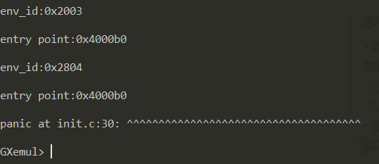
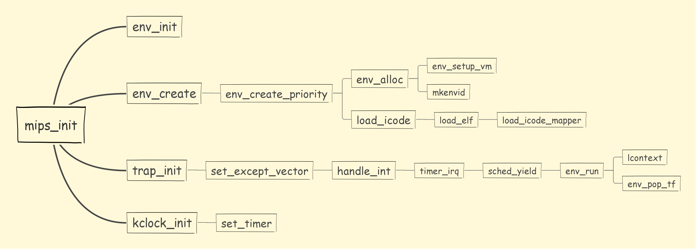

> Author: 16061098 白勇
### 一.思考题
#### **1.为什么我们在构造空闲进程链表时必须使用特定的插入的顺序？(顺序或者逆序)**
&nbsp;&nbsp;只有采用顺序或者逆序，第一次调用env_alloc()的时候才能获得env[0]或者env[NENV-1].
#### **2.思考env.c/mkenvid 函数和envid2env 函数:**

• **请你谈谈对mkenvid 函数中生成id 的运算的理解，为什么这么做？**
&nbsp;&nbsp;低11位存储了该进程控制块在进程控制块数组中的索引值，高位记录了mkenvid被调用的次数，保证每个进程控制块的id都是唯一的。
• **为什么envid2env 中需要判断e->env_id != envid 的情况？如果没有这步判断会发生什么情况？**
&nbsp;&nbsp;因为不同进程控制块的id可能存在低11位的数组索引相同，但是高位不同的情况（即两者不是同一个进程控制块），因此需要提前判断，避免错误操作。

#### **3.结合include/mmu.h 中的地址空间布局，思考env_setup_vm 函数：**

• **我们在初始化新进程的地址空间时为什么不把整个地址空间的pgdir 都清零，而是复制内核的boot_pgdir作为一部分模板？(提示:mips 虚拟空间布局)**
&nbsp;&nbsp;复制的模版部分是内核所在的虚拟地址空间，进程块之间是完全相同的，因此没有必要清零。同时，只有拥有了内核，才能够实现从“用户态”到“内核态”的切换，因此不能清零。
• **UTOP 和ULIM 的含义分别是什么，在UTOP 到ULIM 的区域与其他用户区相比有什么最大的区别？**
&nbsp;&nbsp;处在用户地址空间中的代码不能访问高于ULIM的地址空间，但是内核可以读写这部分空间。而内核和用户对于地址范围[UTOP, ULIM]有着相同的访问权限，那就是可以读取但是不可以写入。这一个部分的地址空间通常被用于把一些只读的内核数据结构暴露给用户地址空间的代码。在UTOP之下的地址范围是给用户进程使用的，用户进程可以访问，修改这部分地址空间的内容。
• **在step4 中我们为什么要让pgdir[PDX(UVPT)]=env_cr3?(提示: 结合系统自映射机制)**
&nbsp;&nbsp;UVPT自映射到了进程页目录的地址，当需要将UVPT区域的虚拟地址转换为物理地址时，就可以方便地找到。
• **谈谈自己对进程中物理地址和虚拟地址的理解**
&nbsp;&nbsp;每个进程都有4G的虚拟地址空间。对于不同的进程，ULIM以上的虚拟地址到物理地址的映射是相同的，ULIM以下的虚拟地址到物理地址的映射则各不相同。

#### **4.思考user_data 这个参数的作用。没有这个参数可不可以？为什么？（如果你能说明哪些应用场景中可能会应用这种设计就更好了。可以举一个实际的库中的例子）**
&nbsp;&nbsp;user_data的类型是(void \*),这是C语言中的泛型编程。函数load_elf的功能就是解析elf文件，并且将其加载到给定地址空间，而无需考虑该地址空间表示的是什么内容，从而提高函数的可重用性。在进程创建过程中，传入的user_data是一个进程控制块的地址。
&nbsp;&nbsp;例如可以利用(void \*)编写一个交换两个变量值的swap函数：
```c
void swap(void *vp1,void *vp2,int size){  
      char buffer[size];
      memcpy(buffer,vp1,size);  
      memcpy(vp1,vp2,size);  
      memcpy(vp2,buffer,size);  
}  
```
&nbsp;&nbsp;采用这种设计，无论需要交换的变量是何种类型，就都可以调用该函数了。

#### **5.结合load_icode_mapper 的参数以及二进制镜像的大小，考虑该函数可能会面临哪几种复制的情况？你是否都考虑到了？**
&nbsp;&nbsp;由于va和bin_size可能不是BY2PG的整数倍，因此产生了许多种可能出现的复制情况，我复制部分的代码如下：
```c++
u_long offset = va - ROUNDDOWN(va, BY2PG);
for (i = 0; i < bin_size; i += BY2PG) {
		r=page_alloc(&p);
		if(r<0){
			return r;
		}
		p->pp_ref++;

		if(i==0){
			size_tmp = (BY2PG-offset < bin_size) ? (BY2PG-offset) : bin_size;
			bcopy(bin,(char *)page2kva(p)+offset,size_tmp);
		}
		else{
			size_tmp = (BY2PG < bin_size-i) ? BY2PG : bin_size-i;
			bcopy(bin+i-offset,(char *)page2kva(p),size_tmp);
		}

		r = page_insert(env->env_pgdir,p,va+i,PTE_V|PTE_R);
		if(r<0){
			return r;
		}
}
```
&nbsp;&nbsp;首先是复制第一页的时候，可能存在其实虚拟地址与BY2PG不对齐的情况，需要进行对齐操作；也可能存在二进制镜像的内容不够填满一页的情况，需要进行判断；
&nbsp;&nbsp;其次是复制接下来各页的时候，每一页都可能出现二进制镜像的剩余内容不够填满一页的情况，需要进行判断。
####  **6.思考上面这一段话，并根据自己在lab2 中的理解，回答：**

• **我们这里出现的” 指令位置” 的概念，你认为该概念是针对虚拟空间，还是物理内存所定义的呢？**
&nbsp;&nbsp;进程直接访问到的时间均为虚拟空间，因此“指令位置”也应该是针对虚拟空间。
• **你觉得entry_point其值对于每个进程是否一样？该如何理解这种统一或不同？**
&nbsp;&nbsp;将进程的entry_point分别输出以后可以发现是一样的，均为0x4000b0.
<div align="center"></div>
&nbsp;&nbsp;entry_point对应程序的入口点地址，不同进程的entry_point相同说明他们的程序入口点地址是相同的。

#### **7.思考一下，要保存的进程上下文中的env_tf.pc的值应该设置为多少？为什么要这样设置？**
&nbsp;&nbsp;env_tf.pc的值应该设置为curenv->env_tf.cp0_epc，cp0_epc寄存器储存了异常发生时进程的PC值。

#### **8. 思考TIMESTACK 的含义，并找出相关语句与证明来回答以下关于TIMESTACK 的问题：**

• **请给出一个你认为合适的TIMESTACK 的定义**
&nbsp;&nbsp;TIMESTACK是一个特殊的栈指针，用于在时钟中断发生时保存进程上下文。
• **请为你的定义在实验中找出合适的代码段作为证据(请对代码段进行分析)**
&nbsp;&nbsp;在stackframe.h中与设置栈指针相关的汇编代码为：
```
.macro get_sp
        mfc0    k1, CP0_CAUSE
        andi    k1, 0x107C
        xori    k1, 0x1000
        bnez    k1, 1f
        nop
        li      sp, 0x82000000
        j       2f
        nop
1:
        bltz    sp, 2f
        nop
        lw      sp, KERNEL_SP
```
&nbsp;&nbsp;通过判断CP0_CAUSE寄存器的相关标志位，如果发生的是时钟中断，则将栈指针设置为0x82000000（即TIMESTACK）,否则则将栈指针的值设置为KERNEL_SP。
• **思考TIMESTACK 和第18 行的KERNEL_SP 的含义有何不同**
&nbsp;&nbsp;如前述，TIMESTACK和KERNEL_SP均为栈指针，TIMESTACK用于发生时钟中断时，KERNEL_SP则用于发生其他异常时。

### 二.实验难点图示
&nbsp;&nbsp;在Lab2实验报告中已经绘制了与内存管理相关的函数调用关系图，如下是与进程管理相关的函数调用关系图：
<div align="center"></div>

### 三.体会与感想
&nbsp;&nbsp;Lab3的课下难度有一点大，尤其是复制二进制镜像文件部分的代码，花费了很多时间去理解和尝试,完成之后收获还是很大的。
* 理解了进程调度的细节。在高级语言的多线程编程中，只是知道JVM可以将线程不断进行切换，但具体是如何实现的并不清楚，经过独自实现时间片轮转算法以后，对这一问题的认识加深了。
* 进一步巩固了关于内存管理的操作。env_init和env_alloc函数在某些程度上与page_init和page_alloc函数有很多相似指出，我在填写lab3代码的时候也参考了lab2的代码，进一步巩固了关于内存管理的操作，例如空闲链表的构建等。
* 了解了时钟中断的作用。在计组实验中实现了CPU对时钟中断的处理，但当时只是把时钟视为一个简单的外设，具体有何用处并不知道，经过这次实验就明白了时钟中断可以用于进程的调度。
