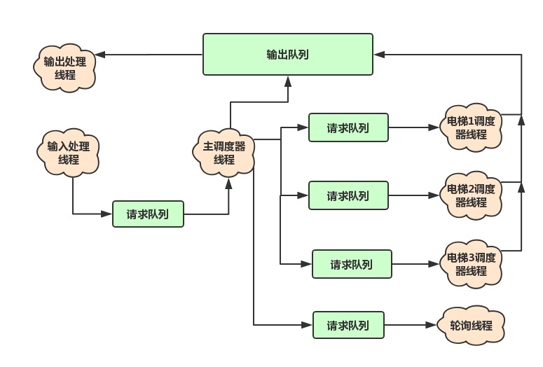

一.代码度量分析 

1.第一次作业

2.第二次作业

3.第三次作业

二.分析自己的bug 

1.需求分析

2.概要设计

3.详细设计

4.编码

5.测试

6.软件交付

三.测试策略

1.基本测试

2.随机测试

3.阅读代码和文档

四.心得体会
一.设计策略分析
1.第五次作业
&nbsp;&nbsp;事实上，在进行第五次作业设计的时候，我对多线程的概念还处于完全懵懂的状态，既不能区分线程同步和线程互斥，也不能区分对象锁和类锁，甚至不知道临界区是什么意思，只会对方法加锁而不会对代码块加锁。在这种朦胧的状态下完成了一个现在看起来也还不错的设计，并且最终通过了所有公测互测，只是因为我在上课时记住了老师说的一句话：“这次设计主要采用<b>生产者-消费者</b>模式”。我的手中恰好有一本结城浩的《图解Java多线程设计模式》，上面对各种设计模式的讲解比较通俗易懂，因此我在设计里大量采用了生产者-消费者模式（一共6对生产者-消费者）：

&nbsp;&nbsp;虽然以现在的角度分析，这种设计存在很多不必要的冗余，例如输出根本不需要作为一个消费者角色的线程类，事实上只需要一个加类锁的静态方法就够了。但是这种设计着实管用，也顺利帮我度过了传说中最困难的一次作业。

2.第六次作业
&nbsp;&nbsp;第六次作业的设计是我最不满意的一次设计，虽然吸取了上一次作业的教训，在作业之前抓紧时间补充了一下线程安全方面的知识，但是还是显得捉襟见肘。首先遇到的最大的难题就是，如何保证文件操作是线程安全的，这在我最初看来是几乎不可能实现的，因为文件操作针对的是一个文件，而对象锁锁住的是一个对象，一个文件可以同时对应多个文件对象，而他们之间是无法实现互斥的。在与同学讨论之后，我们最终采用了一种非常巧妙的办法，使得这一问题得以解决，我将在<b>心得体会</b>章节专门进行记录。此外，由于我采用的是一条请求对应一个线程的设计，线程之间互不沟通，再加上代码的重用性很差，几个触发器的代码存在复制粘贴的现象，导致出现了许多问题。再加上时间仓促，我直到周三的中午，还匆匆忙忙地对代码进行了部分修改，最终还是在互测中被找到了1个bug。
3.第七次作业
&nbsp;&nbsp;第七次作业的设计，就看到了自己的明显提高。根据需要采用了一些设计模式，例如生产者-消费者模式、Thread-per-message模式、Two-Phase Termination模式，但是没有过分依赖。同时有了前两次的经验，能够很得心应手地完成线程安全类的构建（主要是文件操作类使用了类锁，对出租车状态的改变添加了对象锁，同时请求队列采用了阻塞队列）。同时，能够比较精确识别临界区，对代码块加锁，而不是简单粗暴地直接对整个方法进行加锁。

二.代码度量分析

1.第五次作业（电梯控制系统）

(1)代码度量及相应分析

    

        <table style="text-align:center;border:1px solid #e3e197;background:#ffffdd">
            <thead>
                <tr>
                    <th>度量值</th>
                    <th>总计</th>
                    <th>均值</th>
                    <th>标准差</th>
                    <th>最大值</th>
                </tr>
            </thead>
            <tbody>
                <tr>
                    <td>圈复杂度</td>
                    <td></td>
                    <td>3.105</td>
                    <td>3.712</td>
                    <td>15</td>
                </tr>
                <tr>
                    <td>嵌套块深度</td>
                    <td></td>
                    <td>1.842</td>
                    <td>1.225</td>
                    <td>5</td>
                </tr>
                <tr>
                    <td>传入耦合</td>
                    <td></td>
                    <td>0</td>
                    <td>0</td>
                    <td>0</td>
                </tr>
                <tr>
                    <td>传出耦合</td>
                    <td></td>
                    <td>0</td>
                    <td>0</td>
                    <td>0</td>
                </tr>
                <tr>
                    <td>方法个数</td>
                    <td>18</td>
                    <td>4.5</td>
                    <td>2.693</td>
                    <td>8</td>
                </tr>
                <tr>
                    <td>属性个数</td>
                    <td>5</td>
                    <td>1.25</td>
                    <td>1.299</td>
                    <td>3</td>
                </tr>
                <tr>
                    <td>总代码行数</td>
                    <td>261</td>
                    <td></td>
                    <td></td>
                    <td></td>
                </tr>
                <tr>
                    <td>类个数</td>
                    <td>4</td>
                    <td></td>
                    <td></td>
                    <td></td>
                </tr>
            </tbody>
        </table>
    

其中显示红色的是圈复杂度这一项，具体位置如下图所示：

    

<i>Andrew Glover</i>在<i>IBM</i>官方网站上发表的监视圈复杂度分析了圈复杂度对于代码质量的度量，他指出：

<b>圈复杂度</b>是在我前面提到的那些研究期间开创的，它可以精确地测量路径复杂度。通过利用某一方法路由不同的路径，这一基于整数的度量可适当地描述方法复杂度。实际上，过去几年的各种研究已经确定：圈复杂度（或 CC）大于 10 的方法存在很大的出错风险。

从截图可以看出，我CC值最高的方法是是<i>calcul</i>方法，由于该方法同时兼顾了输入处理和多项式拆分计算两个功能，因此if-else分支较多，导致代码逻辑复杂，可读性较差。减少圈复杂度的最有效方式是隔离代码部分，将它们放入新的方法中。在今后的编码中我也应该尽量避免这一问题，并且这次学会使用<i>Metrics</i>以后,今后就可以用它来实时监控自己是否书写了过于复杂的方法了。

(2)类图

    

可以看出第一次作业的结构比较简单，类之间的关联关系也比较少。同时生成的UML类图也与我的设计相符，即<i>polyCompute</i>类承担主要功能，而最基本的类则是<i>Mono</i>单项式类。

2.第二次作业（“傻瓜式”电梯）

(1)代码度量及相应分析

    

        <table style="text-align:center;border:1px solid #e3e197;background:#ffffdd">
            <thead>
                <tr>
                    <th>度量值</th>
                    <th>总计</th>
                    <th>均值</th>
                    <th>标准差</th>
                    <th>最大值</th>
                </tr>
            </thead>
            <tbody>
                <tr>
                    <td>圈复杂度</td>
                    <td></td>
                    <td>2.143</td>
                    <td>2.9</td>
                    <td>12</td>
                </tr>
                <tr>
                    <td>嵌套块深度</td>
                    <td></td>
                    <td>1.4</td>
                    <td>1.101</td>
                    <td>6</td>
                </tr>
                <tr>
                    <td>传入耦合</td>
                    <td></td>
                    <td>0</td>
                    <td>0</td>
                    <td>0</td>
                </tr>
                <tr>
                    <td>传出耦合</td>
                    <td></td>
                    <td>0</td>
                    <td>0</td>
                    <td>0</td>
                </tr>
                <tr>
                    <td>方法个数</td>
                    <td>34</td>
                    <td>4.857</td>
                    <td>2.03</td>
                    <td>9</td>
                </tr>
                <tr>
                    <td>属性个数</td>
                    <td>16</td>
                    <td>2.286</td>
                    <td>1.385</td>
                    <td>5</td>
                </tr>
                <tr>
                    <td>总代码行数</td>
                    <td>316</td>
                    <td></td>
                    <td></td>
                    <td></td>
                </tr>
                <tr>
                    <td>类个数</td>
                    <td>7</td>
                    <td></td>
                    <td></td>
                    <td></td>
                </tr>
            </tbody>
        </table>
    

本次作业虽然需要处理的情形明显增多，但是圈复杂度相较第一次作业有所下降，可见编程习惯有所改善，不过圈复杂度仍然超过了边界10。此次复杂度较高的位置是在调度器中的控制方法和请求类的请求处理中，不得不说，由于需要考虑的特殊情况比较多，这两个方法的逻辑确实有些复杂，同时同一个if的条件也很复杂，虽然我尝试分行书写使得代码更加清晰，但这一做法对提高程序的可读性本身贡献较小。

    

本次作业通过度量发现的另一个问题是嵌套块深度过高，出现的位置是在输入处理阶段，由于我对不合法指令的区分比较细致，因此有一些if-else的嵌套，我在这篇博客中找到了一些优化措施，以后编程中可以有意识地去使用。

- 尽量紧凑。一个函数只赋予一个职责。
- 不要自我重复。优先使用命名函数，而不要让相似的代码片段重复出现。
- 优先使用&&。在可以使用&&条件判断的地方要避免使用连续嵌套的if。
- 不要过分使用try。优先使用析构函数进行自动清除而避免使用try代码块。
- 优先使用标准算法。算法比循环嵌套要少，通常也更好。
- 不要根据类型标签进行分支。也就是尽量不要使用switch…..case语句，而要优先使用多态函数。

(2)类图

    

可以看到这个类图中的<i>Floor</i>类与其他类没有任何关联关系，这是由于基于我的设计，不需要楼层类就可以实现指导书所要求的功能，但是囿于指导书强制要求楼层类的存在，以及为以后的作业设计做铺垫，所以保留了这个楼层类。

3.第三次作业（ALS电梯）

(1)代码度量及相应分析

    

        <table style="text-align:center;border:1px solid #e3e197;background:#ffffdd">
            <thead>
                <tr>
                    <th>度量值</th>
                    <th>总计</th>
                    <th>均值</th>
                    <th>标准差</th>
                    <th>最大值</th>
                </tr>
            </thead>
            <tbody>
                <tr>
                    <td>圈复杂度</td>
                    <td></td>
                    <td>2.585</td>
                    <td>3.51</td>
                    <td>18</td>
                </tr>
                <tr>
                    <td>嵌套块深度</td>
                    <td></td>
                    <td>1.585</td>
                    <td>1.295</td>
                    <td>6</td>
                </tr>
                <tr>
                    <td>传入耦合</td>
                    <td></td>
                    <td>0</td>
                    <td>0</td>
                    <td>0</td>
                </tr>
                <tr>
                    <td>传出耦合</td>
                    <td></td>
                    <td>0</td>
                    <td>0</td>
                    <td>0</td>
                </tr>
                <tr>
                    <td>方法个数</td>
                    <td>51</td>
                    <td>5.667</td>
                    <td>3.559</td>
                    <td>12</td>
                </tr>
                <tr>
                    <td>属性个数</td>
                    <td>22</td>
                    <td>2.444</td>
                    <td>2.217</td>
                    <td>7</td>
                </tr>
                <tr>
                    <td>总代码行数</td>
                    <td>525</td>
                    <td></td>
                    <td></td>
                    <td></td>
                </tr>
                <tr>
                    <td>类个数</td>
                    <td>9</td>
                    <td></td>
                    <td></td>
                    <td></td>
                </tr>
            </tbody>
        </table>
    

可以看到第三次作业的圈复杂度飙升，其实不需要度量工具，我在编写代码的时候就感觉到了自己所书写代码的复杂程度比较高，也因此漏写几句关键代码，直到后期测试的时候才补上，总结起来，一方面是第三次作业的大部分代码沿用自第二次作业，因此第二次代码隐藏的一些问题也继承给了第三次作业；另一方面则是<i>execute</i>等方法的层次划分不够，功能太多，导致复杂度上升。有一点可以肯定的是，关于<i>Scheduler</i>类，第二次作业和第三次作业的<i>Scheduler</i>类功能完全相同，都是“傻瓜式”调度器，但是我在沿用第二次作业代码的时候对该类进行了调整，把一个方法拆分成了具有不同功能的几个方法，圈复杂度也由此从第二次作业的12降到了第三次作业的5，这一提升也为今后降低代码的圈复杂度提供了思路。

    

(2)类图

    

第三次作业中最大的特点就是出现了继承和接口，在UML图中体现为<i>SchedulerALS</i>类对<i>Scheduler</i>类的继承（蓝色箭头）以及<i>Elevator</i>类对于<i>motion</i>接口的实现（绿色箭头）。

二.分析自己的bug

之前的三次作业我的程序都顺利通过公测和互测，并未被发现bug，总结起来还是有许多经验可循。

一个完整的软件开发流程包括如下几个阶段：

需求分析——>概要设计——>详细设计——>编码——>测试——>软件交付——>用户验收——>维护

由于课程设计的模式与实际软件开发略有不同，因此我们需要完成的其实是前6个阶段，即从需求分析到软件交付。

1.需求分析

 首先是需求分析。一个完备的需求分析需要考虑很多问题，包括显式需求和隐式需求两部分。

隐式需求是客户不会交代，但开发者需要了解并考虑到的事情，比如程序何时被使用、在哪里被使用、用户群体是谁、客户提出需求的驱动力是什么。我们的程序设计场景比较简单，很多东西都不需要考虑，但还是有一些隐式的需求。比如我们应该考虑到互测阶段测试我们程序的对方可能采取一些“非常措施”，例如用大规模的数据进行测试，我们应该就此设计防护，包括程序本身加入异常处理机制和在文档中事先声明。

至于显式需求，在《面向对象葵花宝典:思想、技巧与实践》（李运华编）一书中，提出了一种<i>NEA</i>方法，很值得我们借鉴。书中说需求分析可以分为三个部分：正常处理(Normal),异常处理（Exception）,替代处理（Alternative）。正常处理和异常处理是需要我们研读指导书得出的，通过不断罗列各种需求，在头脑中推演，最终形成自己的完善的解决方案。替代处理则是需要我们具有设计前瞻性的，因为我们的程序是几次作业不断沿用的，能在设计“傻瓜式”调度策略时就考虑到该策略可以被其他调度策略完美替代，就是在需求分析时考虑到了替代处理部分。我在这方面做得并不够好，在第三次作业时因为设计模式略有调整，我对第二次作业的调度器做了调整，不过好在改动不大，最终实现了在主类中实例化<i>Scheduler</i>类就得到一部“傻瓜式”电梯，在主类中实例化其子类<i>SchedulerALS</i>，就得到一部ALS电梯。

2.概要设计

设计程序的基本框架是一件很重要的事情，我的三个程序的设计结构已经通过第一部分的UML图有所体现，在此不再赘述。一个良好的设计框架，可以为之后的编码节省很多时间，所谓<i>‘A beard well lathered is half shaved. ’</i>

以后两次作业的电梯为例，就我了解，在概要设计层次上，存在以指令驱动程序和以时间驱动程序两种设计方式。所谓以指令驱动，就是电梯的运行以指令为序，每取出一条指令，根据指令的内容直接调整电梯的运行状态；而以时间驱动，则是程序完全模拟真实的时间流逝，每经过等长的时间间隔，检查指令并调整电梯运行状态。时间驱动可以为许多问题带来方便，比如同质请求的识别，但时间驱动有一个致命的问题，就是运行慢，可能只需要(FR,10,UP,4294967295)一条指令，程序就要执行很长时间了。因此我在第二次作业采用的是指令驱动的方式。

但到了第三次作业，需要考虑捎带请求，我在做设计的时候就发现，指令驱动的弊端也被暴露出来了，因为同一时刻被执行的请求可能不止一条，以某一条指令来判断电梯运行状态显然比较难以实现，需要许多辅助的判断。经过思考，我决定折中，采用指令驱动和时间驱动融合的方式，即还是以主请求作为驱动，但电梯执行具体请求时不是直接跳跃式计算运行状态，而是一层一层地爬升，在每一层判断可稍带请求，这样既可以解决同层执行多条请求的问题，也不会浪费过多时间，实际操作效果良好。

3.详细设计

对于详细设计，我的理解是程序设计应该细致，但不能过分细致，即去完美主义化。由于需求经常在变动，如果过分追求细节的完善的话，反而导致编程迟迟不能开始，拖慢整个工程的进度。我在第三次作业的时候深有体会，对于一些情形是否可以捎带的细节，指导书迟迟不能确定下来，导致我的详细设计一直未能完成，编程也迟迟未能开始。后来我决定关掉微信和issue，不再关注小细节的变动，而是<b>开始工作</b>。因为我相信从概要设计层次来看，我的整体架构并没有大问题，需求的更改很可能只是判断条件的改变，事实证明我的判断是对的，后来虽然因为要求的变更又改了几个小地方，但整个作业的时间并没有因此拖太久。

4.编码

对于编码，我认为最重要的是认真，最好能找一个万籁俱寂的地方，能把自己的思维完全活跃地调动起来，让“我手码我心”。而不是在宿舍一边聊天一边写代码，或者在教室一边听课一边写代码，或者赶时间匆匆忙忙写代码。（具有菜市场读书功力的同学请自行忽略上句）我在写第三次作业的时候，后来自己在测试阶段找出的一些bug，就是因为设计的时候明明想写，但是编程的时候不小心漏掉导致的。

其次就是代码书写风格的问题，由于是刚开始写java程序，我的代码风格也有许多需要改善的地方，这部分内容我将在第四部分“心得体会”进行分析。

5.测试

测试也是整个过程中相当重要的环节，如果说需求分析中对于各种情况的处理分析是防微杜渐，那么测试阶段则是最后一道防线，因此我花费了大量时间对自己的程序进行测试。因为测自己程序的方法也被直接拿来测别人的程序，所以我决定在第三部分对测试进行详细分析。

6.软件交付

在我们的环节中，“软件交付”应该是和写Readme相对应的。Readme是对自己程序的补充，思路清晰的文档可以帮助测试者与被测者沟通，从而导致误解而产生不必要的bug。我在第二次作业中，就发现了对方存在Readme中自定义情况与程序实际运行结果不符的情形。

三.测试策略

所谓测试，最重要的是完备性，理论上说，如果把所有情况都详细地测试一遍，对方的程序全都运行正常，那么说明这个程序就是一个满足所有需求的程序。但是有的时候由于情况本身的复杂性，和自身思维的局限性，完备性是很难做到的，于是就存在另一种测试方法：随机大量选取样本，从概率上覆盖所有情况。我拿到一个程序（包括自己前一天写的程序和对方的程序），测试流程大概如下。

1.基本测试

对于bug较多的程序，例如我第三次拿到的程序公测就有很多点没有通过，基本实现存在问题。因此只需要根据测试树构造简单样例，寻找程序中的漏洞。

2.随机测试

如果基本测试都没有问题，那么可以通过随机多次测试的方式寻找突破，目前还没有通过这种测试找到对方的bug，但是确实帮我排除了一些隐患。在这里可以分享一个我在第二次作业中使用的C代码，代码量并不大，思路也很简单。利用宏定义定义关键变量，然后通过调整参数实现各种期望是大二修算法课的时候在写模拟退火算法和遗传算法时候学到的；而通过C代码随机生成测试序列则开始于大二修计算机组成与设计的时候随机生成大规模汇编指令测试自己的CPU。

    #include <stdio.h>
    #include <stdlib.h>
    #include <time.h>
    
    #define FLOOR 3
    #define TIME_MAX 4294967295
    #define STEP 0.01
    #define NUMBER 100
    
    int main(){
    	double sign;
    	int sort,floor,time_add;
    	unsigned int time_req = 0;
    	int count = 0;
    	FILE *fp;
    	fp = fopen("test.txt","w");
    	srand((unsigned)time(NULL));
    	do{
    		sort = rand()%3;
    		floor = rand()%FLOOR+1;
    		time_add = (int)(rand() * STEP);
    		sign = rand()/(RAND_MAX+1.0);
    		if(
    			fprintf(fp,"(FR,%d,DOWN,%u)\n",floor,time_req);
    		}
    		else if(sort == 1 && floor!=10){
    			fprintf(fp,"(FR,%d,UP,%u)\n",floor,time_req);
    		}
    		else{
    			fprintf(fp,"(ER,%d,%u)\n",floor,time_req);
    		}
    		
    		count++;
    		time_req += time_add;
    	}while(count<NUMBER && time_req<=TIME_MAX);
    	fprintf(fp,"RUN");
    	printf("finished!");
    	return 0;
    }

3.阅读代码和文档

如果前两个步骤都没有找到bug，那么这个程序多半就是一个优秀的程序了，这时候就要乖乖阅读代码，重点阅读自己在编程时候认为容易出现错误的地方，理解编程者的逻辑，并与自己的逻辑进行适时比对，从而发现漏洞。我在第二次作业进行测试的时候，就发现对方有一处地方程序的行为和其Readme并不相符，从而找到了bug。

四.心得体会

虽然前几次作业顺利实现的需求，均未被找出bug，但是我的程序还是存在一些设计和编码上的问题。我通过<i>Eclipse</i>的代码质量分析插件<i>Sonar</i>也找到了一些自己编程上不符合工程规范的习惯，这都是我今后需要改进的。

1.异常处理太过分散

这个问题是在第一次作业发生的，当时我对异常处理机制的使用还不太熟练，如果发生异常，并没有选择抛出，而是直接就地输出错误信息，并使用<i>System.exit()</i>退出执行。这导致异常处理相当分散，如果想修改自己的所有异常输出的话只能采用搜索<i>exit</i>关键词的方式，很容易漏掉。同时多处采用<i>System.exit()</i>也不是好习惯。从第二次作业开始我做出了调整，新建了一个<i>MyException</i>管理所有异常，发生异常时并不就地解决，而是选择抛出，在主类中一并解决，从而实现了对异常的清晰管理。

2.<i>Scheduler</i>类冗杂

在第二次作业中，由于<i>Scheduler</i>类是整个程序的核心，因此我是把主方法放在<i>Scheduler</i>类里的，从而导致获取和处理输入的方法也必须在该类中，造成<i>Scheduler</i>类的冗余，成为所谓的<i>God Class</i>。在第三次作业中我意识到这一问题，选择了将除了调度以外的方法取出，单独形成了主类，使得<i>Scheduler</i>职责相对变得单一，符合SRP原则。

3.没有使用枚举

在第二、三次作业中，实际上存在许多需要有两到三个状态的变量，比如请求发出是在楼层还是电梯，楼层请求是向上还是向下，电梯运行状态是向上、向下还是停靠等，我没有使用枚举，都是用true/false,-1/0/1来表示的，导致代码可读性变差，这是以后编程需要注意的地方。

4.if-else嵌套过多

由于输入处理的特殊情况太多，我的输入处理方法中有多层if-else嵌套，导致代码可读性差，不易维护。<i>Sonar</i>给出的分析结果是该方法的<i>Cognitive Complexity</i>(认知复杂性)过高，以后编程中应该尽量避免这种情况出现。

5.不同的else分支中代码重复

    	if(this.floor < 1 || this.floor > 10){
    		this.excep(ori);
    	}
    	else if(this.floor == 1 && this.des == false){
    		this.excep(ori);
    	}
    	else if(this.floor == 10 && this.des == true){
    		this.excep(ori);
    	}
    

由于判断条件过长，为了简化逻辑，我选择了在不同分支执行相同代码的方法，但我忽略了在修改代码时可能出现一个分支被修改而其他分支忘记修改的结果。<i>Sonar</i>给出的结果是：

<em>Having all branches in a switch or if chain with the same implementation is an error.</em>

6.常量命名不符合命名约定

在我定义无符号整数边界常量时，使用了名字<i>border</i>,但按照命名约定，常量应该命名为<i>\^A-Z(_[A-Z0-9]+)$</i>的形式。
